# [Hugo] 從零搭建Hugo網站並發布到GitHubPages

## 目標
1. 使用Hugo建立靜態網站
2. 發布靜態網站到GitHubPages

## 使用Hugo建立靜態網站
#### 三個步驟
1. 安裝Hugo(windows)
2. 本地端建立Hugo網站版型
3. 本地端運行網站

## 發布靜態網站到GitHubPages
#### 五個步驟
1. 在GitHub建立一個repo:hu-demo
1. 修改BaseURL
2. 在本地端產生靜態網頁
3. 上傳檔案到GitHub
4. 設定GitHub Pages


---


### 1.1 安裝Hugo(windows)
- [下載hugo_extended_0.120.3_windows-amd64.zip](https://github.com/gohugoio/hugo/releases)
- 本地解壓縮完放到指定路徑,並設置系統環境變數
    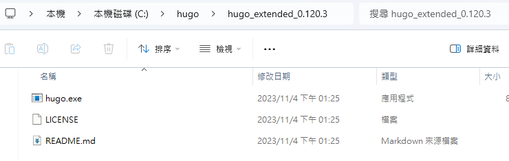
    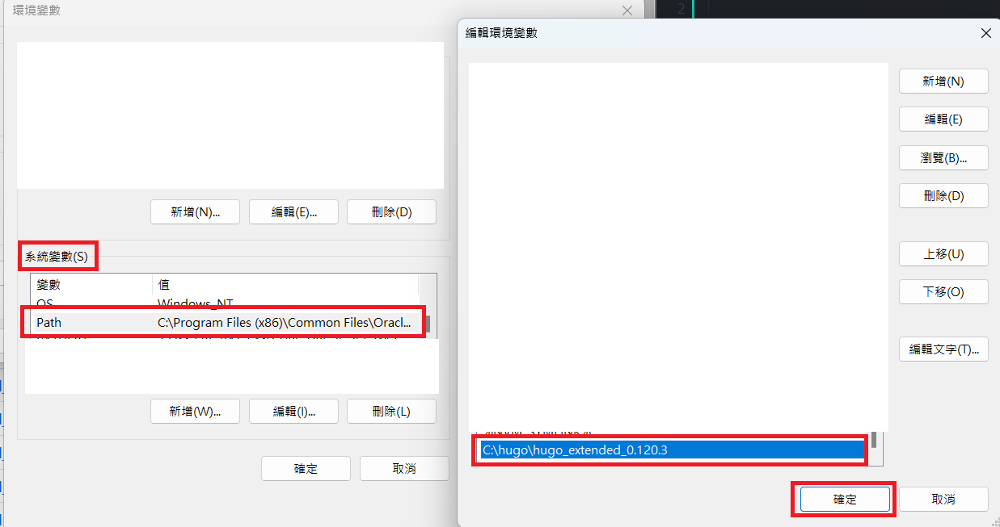
- 確認Hugo指定可以執行
    ```
    hugo version
    ```
    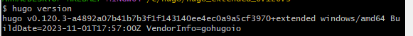


### 1.2 本地端建立Hugo網站版型
```
/移動到C:\hugo
cd .. 

//產生模板
hugo new site hu-demo

/移動到C:\hugo\hu-demo
cd hu-demo

//加入版型
git init
git submodule add https://github.com/mitrichius/hugo-theme-anubis.git themes/anubis

//建立測試文章
hugo new posts/hu-demo-first-post.md

```
- 新增hugo.yaml(=hugo.toml) : 從[hugo-theme-anubis](https://themes.gohugo.io/themes/hugo-theme-anubis/#update-config-file)複製內容
- 目前目錄結構<br>
    

### 1.3 本地端運行網站
```
//本地端運行網站 http://localhost:1313/
hugo server -D
```
- 成功畫面
    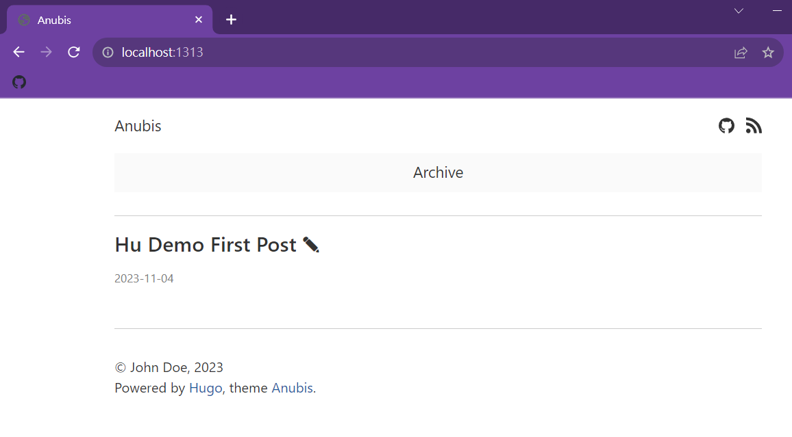
    

### 2.1. 在GitHub建立一個repo: hu-demo
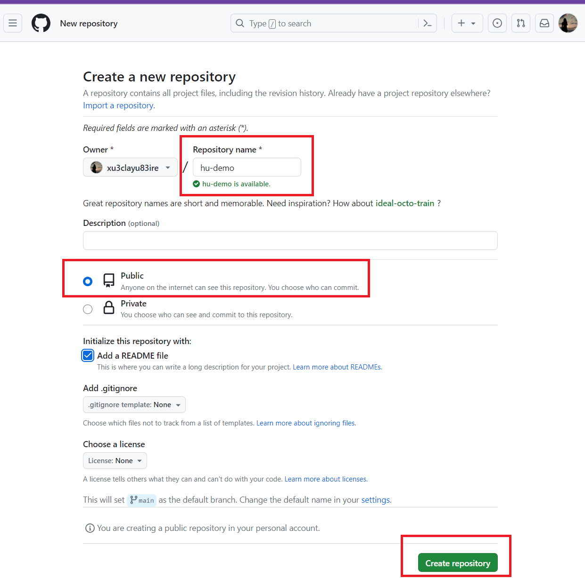


### 2.2. 修改baseURL
```
//在hugo.yaml修改baseUrl
baseUrl: "https://<github.username>.github.io/<github.repo.name>/"
```
    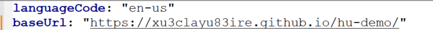


### 2.3. 在本地端產生靜態網頁
```
//產生一個public資料夾,並生成靜態網頁
hugo -D
```
- public資料夾內容<br>
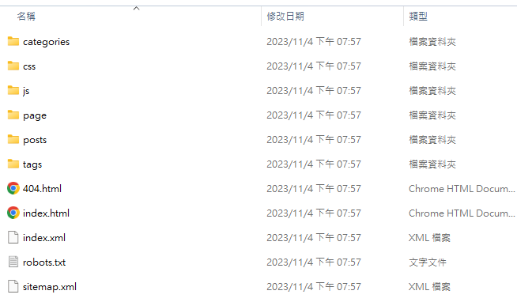


### 2.4. 上傳檔案到GitHub
- 到GitHub.hu-demo上傳public資料夾內容
    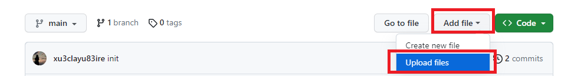
- commit後,hu-demo會出現以下檔案
    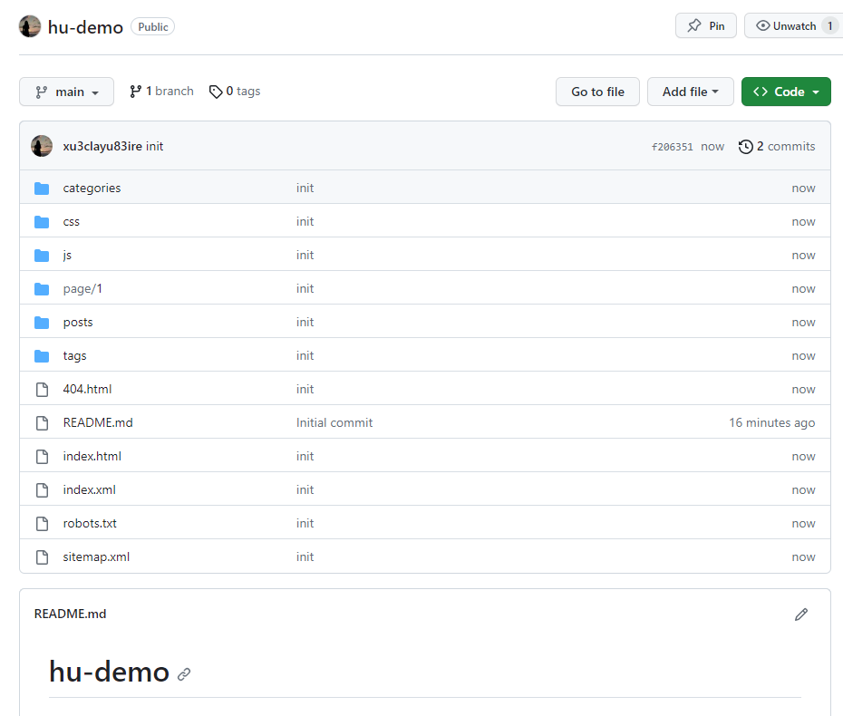


### 2.5. 設定GitHub Pages
- 按照以下1.2.3.4.步驟設定
  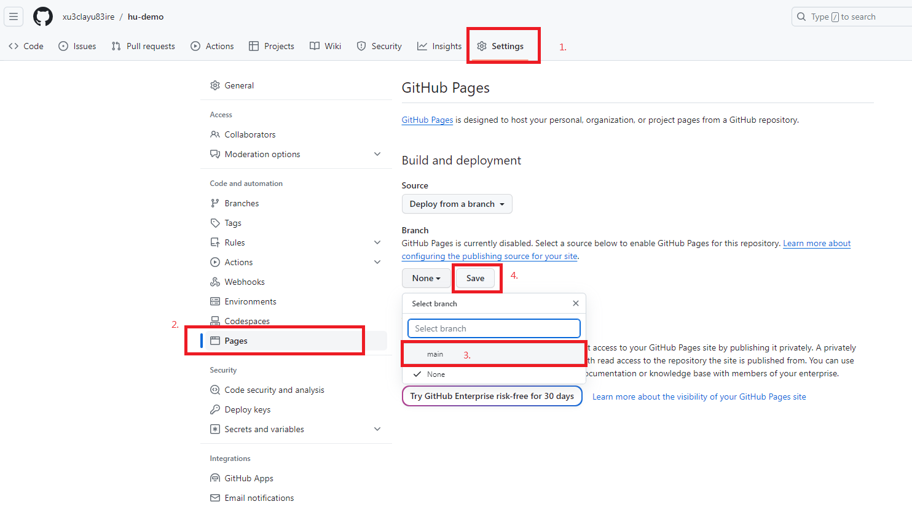
- 點選save後，要等網頁佈署2-3分鐘，再重新整理網頁，會看到網頁路徑
  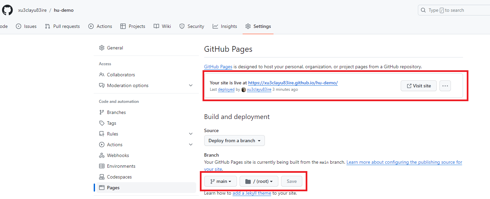
- 網站佈署成功
    [首頁](https://xu3clayu83ire.github.io/hu-demo/)
---


## 參考資源
- [Hugo](https://gohugo.io/)
- [hugo-theme-anubis](https://themes.gohugo.io/themes/hugo-theme-anubis/)
- [使用 Hugo 在 Github Pages 建立靜態網站](https://hackmd.io/@udzQ2BohS5C0Xc66dtaYIA/S1wSWRbrO)
- [使用「Hugo」架設 Blog 起手勢](https://coreynote.life/posts/2022/12/hello-hugo/)
- [HUGO - 基礎教學](https://hi-founder.com/p/hugo-%E5%9F%BA%E7%A4%8E%E6%95%99%E5%AD%B8/#configtoml-%E5%B8%B8%E7%94%A8%E9%A0%85%E7%9B%AE)


